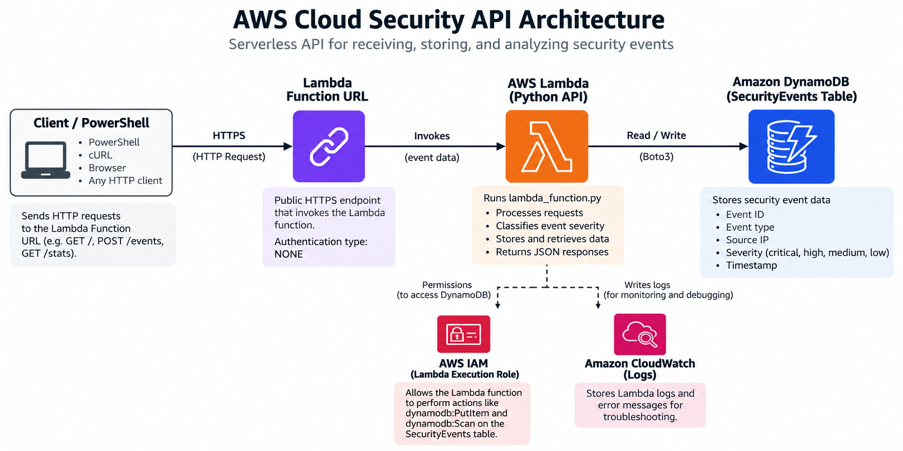
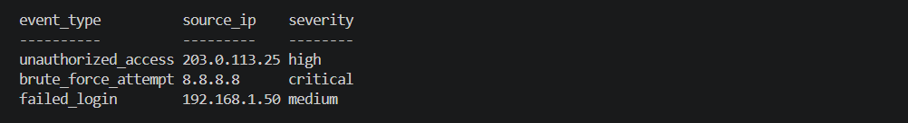
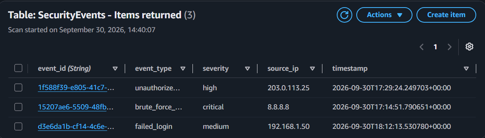
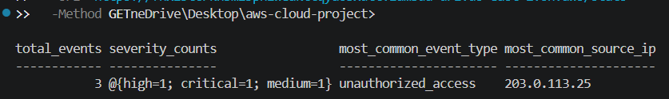

# AWS Cloud Security API

A serverless cloud security API built with Python, AWS Lambda, and Amazon DynamoDB.

I built this project to learn how security event data can be received, classified, stored, and analyzed in a cloud environment. The project started as a local Flask API and was later moved to AWS Lambda to create a fully serverless version.

## What It Does

The API accepts simulated security events such as failed logins, brute-force attempts, and unauthorized access attempts. Incoming events are automatically assigned a severity level and stored in DynamoDB.

The API can also retrieve stored events and generate basic security statistics, including severity counts, the most common event type, and the most common source IP.

## AWS Architecture

Client → Lambda Function URL → AWS Lambda → Amazon DynamoDB

## Technologies

- Python
- AWS Lambda
- Amazon DynamoDB
- AWS IAM
- Amazon CloudWatch
- Lambda Function URLs
- Boto3
- Flask (local development)

## API Endpoints

### `GET /`

Returns basic information about the API and confirms that the cloud service is online.

### `GET /health`

Returns the current health status of the API and a UTC timestamp.

### `POST /events`

Creates a new security event and stores it in DynamoDB.

Supported event types are automatically classified by severity:

| Event Type | Severity |
| --- | --- |
| `brute_force_attempt` | Critical |
| `unauthorized_access` | High |
| `suspicious_login` | High |
| `failed_login` | Medium |
| Other | Low |

Example request:

```json
{
  "event_type": "failed_login",
  "source_ip": "192.168.1.50"
}
```

### `GET /events`

Retrieves security events currently stored in the DynamoDB table.

### `GET /stats`

Analyzes stored security events and returns:

- Total number of events
- Event counts by severity
- Most common event type
- Most common source IP


## Project Structure

```text
aws-cloud-project/
├── screenshots/
│   ├── architecture.png
│   ├── dynamodb-events.png
│   ├── events-endpoint.png
│   └── stats-endpoint.png
├── .gitignore
├── app.py
├── lambda_function.py
├── README.md
└── requirements.txt
```

- `app.py` - Original Flask version used during local development
- `lambda_function.py` - Serverless version deployed to AWS Lambda
- `requirements.txt` - Python dependencies
- `.gitignore` - Prevents unnecessary or sensitive local files from being committed
- `screenshots/` - Architecture diagram and examples of the working API
- `README.md` - Project documentation

## Architecture

The API uses a serverless AWS architecture. HTTP requests are sent through a public Lambda Function URL to a Python Lambda function. The function processes security events, automatically assigns severity levels, stores and retrieves events from DynamoDB, and sends execution logs to CloudWatch.



## Screenshots

### Security Events API

The `/events` endpoint retrieves security events stored in DynamoDB, including their event type, source IP, and automatically assigned severity.



### DynamoDB Event Storage

Security events submitted to the API are persisted in the `SecurityEvents` DynamoDB table.



### Security Event Statistics

The `/stats` endpoint analyzes stored events and returns information such as total events, severity counts, the most common event type, and the most common source IP.



## What I Learned

This project gave me hands-on experience working with AWS services rather than only running an application locally. I learned how Lambda, DynamoDB, IAM permissions, Function URLs, and CloudWatch work together to deploy and troubleshoot a serverless API.

I also learned how to test API endpoints, read AWS error messages and logs, and trace problems through different parts of a cloud application.